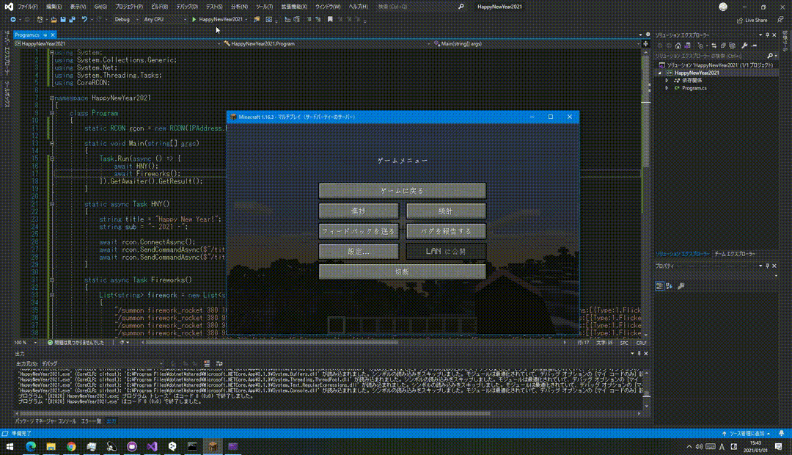

# HNY2021Minecraft
 This is a program to display "Happy New Year" on the Minecraft screen.  

 Before running the program, please start and log in to a Minecraft server with RCON connection settings. Also, adjust the coordinates of the fireworks by replacing them with the coordinates of the player.  
 

 <b>Happy New Year!</b>
